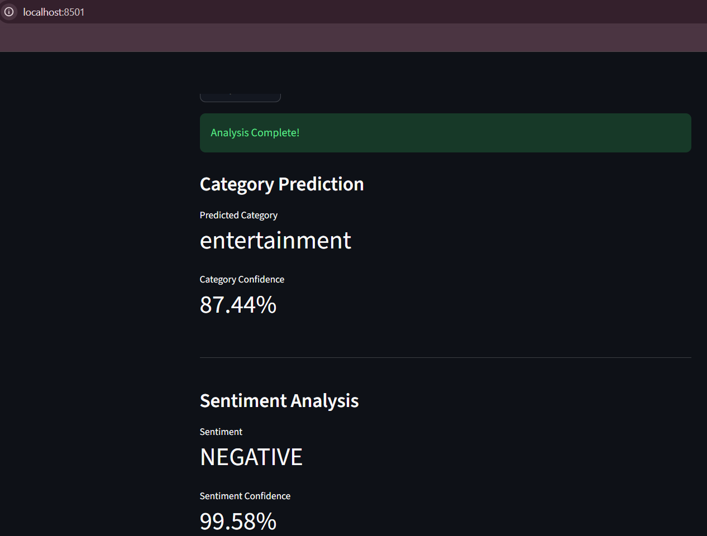
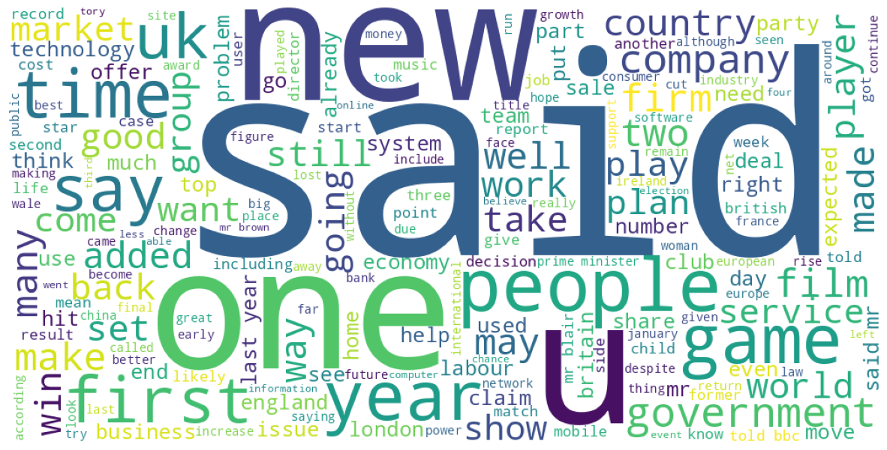
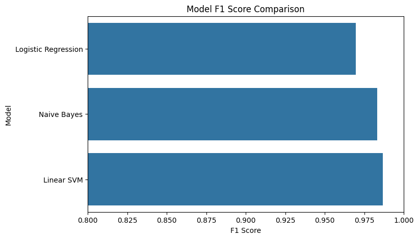
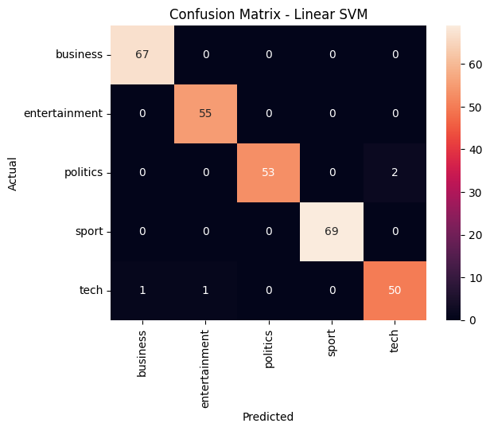

# News Category Classification and Sentiment Analysis using NLP

## Overview

This project is an end-to-end Natural Language Processing (NLP) application that automatically classifies news articles into predefined categories and performs sentiment analysis on user-provided text.

The system leverages TF-IDF feature engineering, machine learning-based text classification, probability calibration for confidence estimation, and Transformer-based sentiment analysis. An interactive Streamlit application allows users to test the model in real time.

---

## Live Demo

**Streamlit Application:**
(https://news-category-classifier-and-sentiment-analysis.streamlit.app/)

Example:

```text
(https://news-category-classifier-and-sentiment-analysis.streamlit.app/)
```

---

## Project Demo

### Sample Prediction



The application allows users to enter a news headline or article snippet and receive:

* Predicted news category
* Prediction confidence score
* Sentiment label
* Sentiment confidence score

---

## Features

* Automated News Category Classification
* Real-Time Prediction Pipeline
* Sentiment Analysis using Transformers
* Confidence-Based Predictions using Calibrated SVM
* Text Preprocessing using NLTK
* Model Explainability through Feature Importance Analysis
* Interactive Streamlit Web Application
* Saved Model and Vectorizer for Efficient Deployment

---

## Dataset

The project uses a news classification dataset containing articles belonging to categories such as:

* Business
* Entertainment
* Politics
* Sport
* Technology

The dataset was used to train and evaluate multiple machine learning models before selecting the best-performing classifier.

---

## Project Workflow

### 1. Data Preprocessing

Text preprocessing includes:

* Lowercasing
* Punctuation removal
* Tokenization
* Stopword removal
* Lemmatization
* Removal of non-alphabetic tokens

---

### 2. Exploratory Data Analysis

Performed analysis on:

* Category distribution
* Text length distribution
* Frequent words before preprocessing
* Frequent words after preprocessing
* Word cloud visualization

### Word Cloud After Preprocessing



---

### 3. Feature Engineering

TF-IDF Vectorization

Configuration:

* Maximum Features: 5000
* N-grams: (1,2)

This converts textual information into numerical feature vectors suitable for machine learning models.

---

### 4. Model Training and Evaluation

The following models were trained and compared:

* Logistic Regression
* Multinomial Naive Bayes
* Linear SVM

Performance was evaluated using:

* Accuracy
* Precision
* Recall
* F1-Score

---

## Model Performance

### Accuracy Comparison


### F1-Score Comparison



After comparison, **Linear SVM** achieved the highest performance and was selected as the final model.

---

## Hyperparameter Tuning

GridSearchCV was used to optimize the Linear SVM model.

Parameters tuned:

```python
param_grid = {
    "C": [0.01, 0.1, 1, 10, 100]
}
```

This improved model generalization and robustness.

---

## Confidence-Based Predictions

Since Linear SVM does not provide probability estimates by default, the model was calibrated using:

```python
CalibratedClassifierCV
```

This enables:

* Confidence scores
* Probability-based predictions
* Improved interpretability

---

## Model Explainability

Feature importance analysis was performed to understand which words contribute most strongly to category predictions.

Examples:

* Business → market, company, economy
* Sport → match, team, player
* Politics → government, minister, election
* Technology → software, internet, technology

This improves transparency and interpretability.

---

## Confusion Matrix



The confusion matrix provides a detailed view of model performance across all categories.

---

## Sentiment Analysis

The application performs sentiment analysis using a Transformer-based model from Hugging Face.

Output includes:

* Positive
* Negative
* Confidence score

This adds an additional layer of understanding beyond category classification.

---

## Project Structure

```text
News_Category_Classifier/
│
├── app.py
├── README.md
├── requirements.txt
├── .gitignore
│
├── models/
│   ├── calibrated_svm_news_classifier.pkl
│   └── tfidf_vectorizer.pkl
│
├── src/
│   ├── __init__.py
│   ├── preprocessing.py
│   ├── predictor.py
│   └── sentiment.py
│
├── notebooks/
│   └── News_Category_Classification.ipynb
│
└── assets/
    ├── sample_output.png
    ├── confusion_matrix.png
    ├── model_accuracy_comparison.png
    ├── model_f1_comparison.png
    └── wordcloud_after_preprocessing.png
```

---

## Technologies Used

### Programming Language

* Python

### Libraries and Frameworks

* Pandas
* NumPy
* NLTK
* Scikit-learn
* Transformers
* Joblib
* Streamlit
* Matplotlib

---

## Installation

Clone the repository:

```bash
git clone https://github.com/your-username/News-Category-Classifier.git

cd News-Category-Classifier
```

Install dependencies:

```bash
pip install -r requirements.txt
```

Run the application:

```bash
streamlit run app.py
```

---

## Results

* Achieved high classification accuracy using Linear SVM
* Improved reliability through cross-validation and hyperparameter tuning
* Enabled confidence-based predictions through model calibration
* Added explainability through feature importance analysis
* Built a complete deployment-ready NLP application

---

## Future Improvements

Potential future enhancements include:
* BERT-based news classification
* Named Entity Recognition (NER)
* Topic Modeling
* Multilingual News Classification
* News Recommendation System
* Real-Time News API Integration

---

## Author
Vedant Bhatt

B.Tech Artificial Intelligence and Machine Learning

LinkedIn: www.linkedin.com/in/vedantbhatt15
